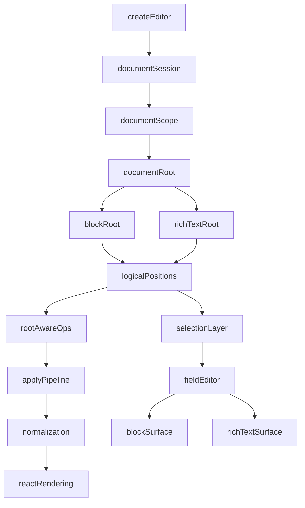

# DocumentRoot and RichText Mode RFC

## Superseded

This RFC is superseded by `spec/flowModeRfc.md`.

Pen's recommended direction is now:

- keep the block model universal
- implement simple rich text as a block-native flow mode
- avoid introducing a second authored root architecture unless future evidence proves it is necessary

## Status

Proposed.

## Summary

This RFC defines how Pen should support a first-class continuous rich-text editor without making blocks mandatory, while preserving the current block-native architecture for structured documents, layout, tables, databases, apps, and nested editor scopes.

The core decision is:

- keep `DocumentSession` and `DocumentScope` as the orchestration layer
- introduce `DocumentRoot` as the authored shape inside a scope
- support at least two root kinds:
  - `BlockRoot`
  - `RichTextRoot`

This is the recommended end-state because it preserves Pen's current strengths while allowing Pen to compete more directly with ProseMirror- and Tiptap-style editors for the continuous rich-text use case.

## Problem

Pen's current architecture assumes that every authored document is fundamentally a block document:

- `spec/v01.md` defines the authored backbone as a vertical sequence of typed blocks
- `spec/wave03EditorCore.md` and `packages/types/src/types/editor.ts` center document state around `blockOrder`
- `packages/types/src/types/selection.ts` and `packages/types/src/types/ops.ts` address text through `{ blockId, offset }`
- `spec/wave05ReactRendering.md` and `packages/rendering/react/src/primitives/editor/content.tsx` render the editor as a block list with a shared field editor layered on top

This works well for Notion-style editing, but it makes a classic rich-text editor feel secondary. A user who wants a clean continuous editor currently gets a block model with richer cross-block editing, not a native continuous document model.

That gap matters if Pen wants to be a serious alternative to ProseMirror-based stacks.

## What Changed Recently

The new Yjs and core work materially improves the implementation path:

- `packages/core/src/editor/documentSession.ts` introduces `DocumentSession`
- `packages/types/src/types/editor.ts` exposes `documentSession` and `documentScopeId`
- `packages/core/src/editor/editor.ts` now binds editors through `DocumentSession` and `DocumentScope`
- subdocuments are now discoverable and editable as nested scopes

This means Pen already has a good orchestration model for multiple documents and nested scopes.

What is still missing is the authored root abstraction inside a scope.

## Goals

- Support a first-class continuous rich-text editor mode with no required top-level blocks.
- Preserve the current block-native document model as a first-class path.
- Reuse one session/orchestration model across root kinds.
- Keep `editor.apply()` as the canonical mutation boundary.
- Keep Pen headless, extension-first, and CRDT-first.
- Allow rich-text mode to ship incrementally without requiring full parity for every advanced block feature.

## Non-Goals

- This RFC does not remove the existing block editor path.
- This RFC does not require rich-text mode to support tables, databases, layout, apps, or every structural block feature in v1.
- This RFC does not allow a live document to freely switch root kinds without conversion.
- This RFC does not fully redesign specialized editing surfaces such as table cell editing.
- This RFC does not require immediate renderer parity for all existing block interactions.

## Design Principles

### 1. One Session Model, Multiple Root Models

`DocumentSession` and `DocumentScope` manage document lifetimes, observation, awareness, and nested scope discovery.

`DocumentRoot` defines the authored shape inside a scope.

This prevents Pen from coupling document orchestration to one specific content model.

### 2. Root Kind Is A Document Invariant

A scope hosts exactly one authored root kind:

- `block`
- `richtext`

The root kind is part of document identity and validation. It is not just a renderer toggle.

### 3. Blocks Become A Root Feature, Not A Universal Assumption

Blocks remain first-class in `BlockRoot`, but they are no longer assumed by every selection API, mutation API, normalization rule, or renderer path.

### 4. One Apply Pipeline

Pen must keep one canonical mutation path:

- all writes still go through `editor.apply()`
- root-specific ops are validated and executed through the same pipeline
- undo, diagnostics, transforms, and collaboration continue to hang off one mutation system

### 5. Native Rich Text Means Native Data Model

The long-term rich-text path should not be "one hidden paragraph block forever".

That can be a validation tactic, but not the true architecture. The final design should give rich-text mode a native authored root and native selection/mutation semantics.

## Terminology

### `DocumentSession`

Owns:

- the root CRDT document
- nested subdocuments
- scope registration
- awareness instances
- scope observation
- editor attachment lifetimes

### `DocumentScope`

Identifies one mounted authored document within a session.

A scope may be:

- the root scope
- a subdocument scope

Each scope contains exactly one authored root.

### `DocumentRoot`

Defines the authored content model inside a scope.

Initial root kinds:

- `BlockRoot`
- `RichTextRoot`

## Proposed Architecture



## Root Kinds

## A. `BlockRoot`

`BlockRoot` preserves today's model:

- ordered `blockOrder`
- block maps keyed by block id
- per-block content types such as inline text, table content, nested children, and subdocuments
- current block-level selection, block commands, and block renderers

This remains the default path for structured editing.

## B. `RichTextRoot`

`RichTextRoot` represents a continuous document tree rather than a block list.

It is designed for:

- paragraphs
- headings
- lists
- links
- marks
- inline nodes
- continuous selection and editing

`RichTextRoot` is not a "render all blocks without borders" mode. It is a separate authored root kind with its own traversal and mutation semantics.

## CRDT Representation

### Root Metadata

Each scope must record its root kind in metadata.

Recommended metadata key:

- `metadata.rootKind = "block" | "richtext"`

This allows:

- root-aware validation
- root-aware bootstrapping
- root-aware import/export
- stable loading across editors

### `BlockRoot` Storage

Keep the current Yjs representation:

- `blockOrder: Y.Array<string>`
- `blocks: Y.Map<Y.Map<unknown>>`
- `apps: Y.Map<Y.Map<unknown>>`
- `metadata: Y.Map<unknown>`

### `RichTextRoot` Storage

Use a tree-shaped Yjs representation.

Recommended representation:

- `richtextRoot: Y.XmlFragment`

Rationale:

- `Y.Text` is strong for linear rich text but weak as the primary representation for a tree-structured document
- `Y.XmlFragment`, `Y.XmlElement`, and `Y.XmlText` provide a better fit for continuous rich-text documents with structural nodes
- Yjs subdocuments already give Pen a natural boundary for nested authored scopes; XML types give Pen a natural tree inside each rich-text scope

This RFC therefore recommends:

- `BlockRoot` stays Y.Array/Y.Map/Y.Text-based
- `RichTextRoot` uses `Y.XmlFragment` as the authored root

## Validation

Validation must become root-kind-aware.

### `BlockRoot` validation

Keep the current checks around:

- shared type presence
- `blockOrder`
- block maps
- orphan and duplicate handling
- per-block content key integrity

### `RichTextRoot` validation

Add validation for:

- presence of `richtextRoot`
- XML node shape correctness
- allowed top-level node kinds
- invalid structural nesting
- unsupported embedded node types

The validator should fail fast on root-kind mismatch.

Example:

- if `metadata.rootKind === "richtext"` but `blockOrder` is the only authored root, validation fails
- if `metadata.rootKind === "block"` but `richtextRoot` is present and the block structures are missing, validation fails

## Selection Model

The current selection model is block-addressed. That is not sufficient for `RichTextRoot`.

### Decision

Introduce generalized logical positions.

Example shape:

```ts
type LogicalTextPoint =
  | { kind: "block"; blockId: string; offset: number }
  | { kind: "document"; path: number[]; offset: number }
```

This is intentionally not a single global text offset.

### Why Not Global Offsets

Global offsets are attractive early, but they become fragile once the document contains:

- structural nodes
- inline embeds
- non-text nodes
- future specialized rich-text widgets

Path-based logical positions are more durable and closer to how serious tree editors reason about position.

### Required selection behavior

- `editor.selection` remains canonical
- `TextSelection` works for both root kinds
- `DocumentRange` becomes root-aware
- clipboard, replace, delete, undo, and history restoration all use logical positions rather than assuming block ids

## Operation Model

The operation model must become root-aware while preserving one apply pipeline.

### `BlockRoot` ops

Keep the current operations:

- `insert-block`
- `delete-block`
- `move-block`
- `split-block`
- `merge-blocks`
- block-scoped text and formatting ops

### `RichTextRoot` ops

Add root-scoped operations for:

- insert text at logical position
- delete text range
- format text range
- insert structural node
- remove structural node
- wrap or unwrap structural range when needed

The exact op names can be finalized during implementation, but they must be expressed in terms of the rich-text root rather than block ids.

### Invariant

Both root kinds still mutate through:

- `editor.apply(ops, { origin })`

No parallel mutation path should exist for rich-text mode.

## `DocumentState`

`DocumentState` must stop exposing only block-oriented primitives as if they are universal.

### Decision

Split state into:

- shared document-scope metadata
- root-specific traversal interfaces

Possible direction:

```ts
interface DocumentState {
  readonly rootKind: "block" | "richtext";
  readonly generation: number;
}
```

Then add root-specific helpers behind narrow interfaces instead of forcing every caller through `blockOrder`.

Examples:

- `BlockDocumentState`
- `RichTextDocumentState`

The exact TypeScript surface can vary, but the important rule is:

- code that only works for blocks should type against a block-specific interface
- cross-root code should type against the shared interface

## Rendering Model

The shared field-editor principle remains valid.

### `BlockRoot` rendering

Keep today's model:

- render a block list
- activate the field editor against block surfaces
- use expanded surfaces for cross-block editing

### `RichTextRoot` rendering

Render one continuous editing surface as the normal path.

This means:

- no top-level block list requirement
- no block insertion on click-above or click-below behavior
- selection and caret mapping target the document surface directly
- inline formatting and structural node rendering happen inside the rich-text surface

### Field editor role

`FieldEditorImpl` should remain the editing-session owner, but it must stop assuming every text surface is block-scoped.

It should be able to attach to:

- a block-backed surface
- a rich-text document surface

## Feature Matrix

### `BlockRoot` first-class features

- layout
- tables
- databases
- apps
- cross-block selection
- structural block commands
- nested block hierarchies
- subdocument blocks

### `RichTextRoot` v1 features

- paragraphs
- headings
- lists
- bold, italic, underline, strike, code
- links
- inline nodes
- copy, cut, paste
- import from HTML and Markdown
- export to HTML and Markdown
- undo and redo
- AI transforms and command surfaces

### Deferred from `RichTextRoot` v1

- full table editing
- databases
- layout containers
- app anchoring parity
- block drag-and-drop semantics
- complex structural block selection overlays

## Commands and Input Behavior

Commands must become root-aware.

### `BlockRoot`

Keep current block-aware behaviors such as:

- split block on Enter
- merge blocks on Backspace
- insert paragraph before or after a block
- block conversion

### `RichTextRoot`

Use continuous document semantics:

- Enter inserts or splits structural rich-text nodes according to rich-text rules
- Backspace and Delete operate on logical positions and tree boundaries
- slash commands operate on the current document node context rather than block type
- select-all targets the document root

## Import and Export

Importers and exporters must become root-aware.

### Conversion rules

- Markdown and HTML importers may target either `BlockRoot` or `RichTextRoot`
- conversion between root kinds should happen through explicit import/export or migration steps
- a document should not silently flip root kinds at runtime

### Practical rule

`createEditor()` should either:

- create a scope with a declared root kind
- or load a scope whose root kind is already encoded in metadata

## Migration Strategy

## Phase 0: Validation Track

Before the full `RichTextRoot` lands, Pen may ship a validation path that presents a continuous editing UX over the current engine for product learning.

This phase must be treated as temporary.

Its job is to validate:

- demand
- UX expectations
- command ergonomics
- import/export expectations

It must not lock the final data model.

## Phase 1: Root Metadata and Validation

- add root-kind metadata
- update document validation to be root-kind-aware
- keep `BlockRoot` as the only fully supported root initially

## Phase 2: Type and Selection Generalization

- generalize logical positions
- generalize `TextSelection` and `DocumentRange`
- make shared interfaces stop assuming block ids everywhere

## Phase 3: Root-Aware Apply Pipeline

- keep current block ops
- add rich-text-root ops
- execute both through the same apply pipeline

## Phase 4: RichTextRoot Storage and State

- add `Y.XmlFragment` storage
- implement rich-text-root traversal
- implement normalization rules for rich-text documents

## Phase 5: React Rendering

- preserve block rendering
- add a rich-text document surface
- make `FieldEditorImpl` attach to either surface type

## Phase 6: Commands, Clipboard, Importers, Exporters

- make command routing root-aware
- make clipboard root-aware
- make import/export root-aware

## Acceptance Criteria

This RFC is successfully implemented when:

1. A Pen editor can mount a scope whose authored root is `RichTextRoot`.
2. Rich-text mode works without top-level blocks.
3. `editor.selection` and `editor.apply()` remain canonical across both root kinds.
4. `BlockRoot` behavior continues to work without regression.
5. The renderer can switch behavior based on root kind without forking the entire editor architecture.
6. Rich-text mode feels native in both UX and storage model, not like a thin block-emulation layer.

## File Map

This RFC primarily impacts:

- `spec/v01.md`
- `spec/wave03EditorCore.md`
- `spec/wave05ReactRendering.md`
- `spec/crossBlockSelectionRfc.md`
- `packages/types/src/types/editor.ts`
- `packages/types/src/types/selection.ts`
- `packages/types/src/types/ops.ts`
- `packages/core/src/editor/documentSession.ts`
- `packages/core/src/editor/editor.ts`
- `packages/core/src/editor/apply.ts`
- `packages/core/src/editor/selection.ts`
- `packages/core/src/editor/range.ts`
- `packages/core/src/schema/normalize.ts`
- `packages/rendering/react/src/primitives/editor/content.tsx`
- `packages/rendering/react/src/field-editor/fieldEditorImpl.ts`

## Final Recommendation

The optimal path is:

- keep `DocumentSession`
- keep `DocumentScope`
- add `DocumentRoot`
- preserve `BlockRoot`
- implement `RichTextRoot` as a true tree-backed authored root

That gives Pen two strong authoring modes on one engine:

- a structured block editor
- a continuous rich-text editor

without forcing either one to masquerade as the other.
