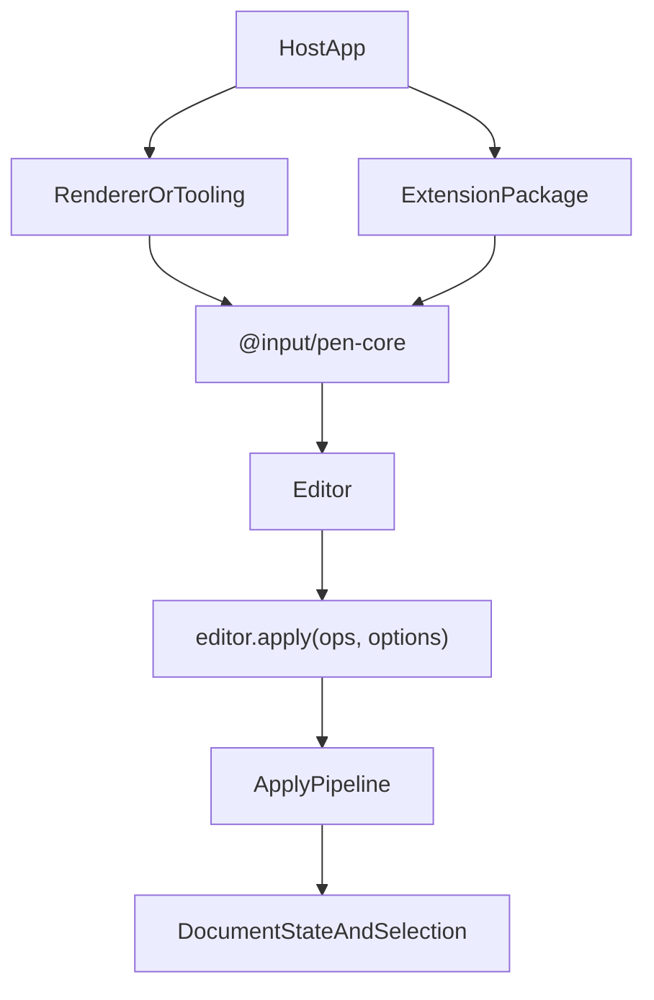

# @input/pen-core

## Purpose

`@input/pen-core` is the headless runtime authority for Pen. It owns editor creation, document state, selection, extension dispatch, normalization, decorations, and the canonical mutation path.

## Public Role

Every higher-level package depends on the contracts and runtime behavior established here. Renderer packages mount the editor, extension packages add behavior, and import/export packages prepare or consume document state, but `@input/pen-core` remains the place where document truth is created and mutated.

## Key Exports / Entrypoints

- Export map: `.`
- Runtime entrypoints such as `createEditor()`, `createHeadlessEditor()`, and `createDocumentSession()`
- Schema runtime exports such as `defineBlock()`, `defineExtension()`, `prop()`, `SchemaRegistryImpl`, `mergeSchemas`, and `SchemaEngineImpl`
- Read-model and editor helpers such as `DocumentStateImpl`, `SelectionManagerImpl`, `DocumentRangeImpl`, and `ExtensionManagerImpl`
- Decoration and inline-completion helpers such as `createDecorationSet()`, `mergeDecorationSets()`, `ensureInlineCompletionController()`, and `getInlineCompletionController()`
- Import and profile-policy helpers such as `blocksToOps()`, `normalizePendingBlocksForImport()`, `filterOpsForDocumentProfile()`, and related policy-reporting APIs. `@input/pen-content-ops` re-exports these; core owns the implementation.
- Block-capability helpers (`getFlowCapabilityFromSchema()`, `shouldExposeBlockInTooling()`, and siblings) and selection-target helpers (`resolveSelectionTargetBlockIds()`, `renderSelectionTargetText()`, `renderSelectionTargetBlockText()`)
- Catalog helpers (`interpolateMessage()`, `resolveMessage()`), mutation-group helpers (`createMutationGroupMetadata()`, `getApplyOptionsGroupId()`, `getOpOriginGroupId()`, `getOpOriginType()`), field-editor helpers (`usesInlineTextSelection()`, `supportsInlineMarks()`, and siblings), and tool-execution helpers (`resolveToolExecution()`, `collectToolExecutionOutput()`)
- Locale-aware case folding (`foldAndNormalize()`) next to `localeFacet`; search, AI alignment, and suggestions call this instead of `toLowerCase()`
- Core facets including `keymapFacet` (`pen.keymap`), `inputRulesFacet`, `beforeApplyFacet`, `decorationsFacet`, `commandsFacet`, `readOnlyFacet`, `clipboardFacet`, `urlPolicyFacet`, `localeFacet` (`pen.locale`), `messagesFacet` (`pen.messages`), `a11yLabelFacet` (`pen.a11yLabel`), and `aiEgressFacet` (`pen.aiEgress`)
- `streamThroughEgress()` / `aiEgressExtension()` — generation, suggestions, and autocomplete share this single egress seam
- The SEC1 URL admission policy (`urlPolicy`, `UrlContext`, `UrlPolicy`) next to `urlPolicyFacet`; `@input/pen-dom` re-exports it for renderer hosts, and the exporters read it from here so no extension depends on a renderer
- Workspace scripts: `build`, `clean`, `test`, `typecheck`

## Dependencies And Boundaries

- Runtime dependencies: `@input/pen-crdt-yjs`, `@input/pen-types`
- Peer dependencies: No peer dependencies declared.
- Boundary: `@input/pen-core` is the runtime center of gravity for Pen and should remain headless. It does not depend on shortcuts, undo, delta-stream, document-ops, content-ops, or markdown-serialization. Those packages depend on core, or re-export helpers that now live here.

## Runtime Model

The core runtime sits between package contracts and the packages that bind or extend the editor:

Important rules:

- `DocumentOp[]` is the mutation currency.
- Durable document writes go through `editor.apply(...)`.
- Structured operation origins can carry `groupId`, `requestId`, `actorId`, and `source` metadata so hosts can attribute and group mutations without inventing a parallel apply path. The apply pipeline passes that structured object into `adapter.transact` without copying it; the Yjs adapter matches it with a `TrackedOriginSet` (see `@input/pen-crdt-yjs`).
- Feature composition is opt-in. Bare `createEditor()` installs the apply pipeline only: no schema (empty registry, `firstBlock()` is `null`), no rich-text shortcuts, no undo, no delta-stream, no document-ops. The no-preset fallback list is empty. `createEmptySchema()` still _resolves_ unknown types as passthrough (`onUnknownBlock: "passthrough"`), so `schema.resolve("paragraph")` is not `null` — it is just not a registered type. `defaultPreset()` is the batteries-included path.
- Without `undoExtension()`, `editor.undoManager` is an inert stub: `canUndo()` / `canRedo()` return `false`, `undo()` / `redo()` return `false`, and the `undo:manager` slot is absent. There is no error. Undo looks present and does nothing. Install `undoExtension()` or `defaultPreset()`.
- `pen.readOnly` (`readOnlyFacet`) some-combines booleans. It does **not** decline typing, does **not** stop `editor.apply`, and does **not** stop the wire. Renderers read it only to set `aria-readonly`. The `readonly` prop on `EditorRoot` / `PenEditor` / `mountEditor` is what declines local typing. That split is shipped and is an open owner decision; this spec records it, it does not resolve it.
- `editor.blocks()` / `editor.blockCount()` walk nested and layout children, matching `documentState.blocks` / `documentState.blockCount`. `documentState.blockOrder` is the top-level sequence only.
- Extensions can prepare work, observe editor events, and register slots, but they do not bypass the core mutation boundary.
- Renderer packages read `DocumentState`, `BlockHandle`, selection, and decorations from the editor; they do not become alternate document authorities.
- `Extension.keyBindings` still exists as a v1 rider. Core copies those bindings onto `keymapFacet` at install. New shortcut work should declare `keymapFacet` providers; several shipped extensions already do.
- Command registration and the selection engine are mid-flight (command registry migration; Wave 05 selection). Do not treat either as settled from this spec.

## Headless Workflows

`createHeadlessEditor()` is the preferred factory for server-side or workflow-only editor use. It keeps Pen headless and applies the same document pipeline to existing CRDT documents without mounting a renderer. Hosts should use it for AI workers, export workers, migrations, and contract tests that need editor semantics without UI behavior.

Headless editors default to the core apply pipeline only, same as bare `createEditor()`: empty schema unless one is passed, empty extension list. To get undo, shortcuts, or delta-stream in a non-rendered workflow, pass `preset: defaultPreset(...)` or register those extensions explicitly. `createHeadlessEditor({ useDefaultExtensions: true })` currently does not install any of those packages — it only skips the empty headless preset object. That option is vestigial; the JSDoc on the flag still claims it enables undo/shortcuts/delta-stream. Prefer an explicit preset.

## Integration Notes

- Path in workspace: `packages/core`
- Spec path mirrors workspace path: `packages/core.md`
- Typical adoption starts with `createEditor({ preset: defaultPreset() })`. Bare `createEditor()` is the wrong default for a rich-text host.
- React and Vue `useEditor()` inject `defaultSchema` and still install no preset. Same empty extension list as bare `createEditor()`.
- Use `createEditor({ preset: defaultPreset(...) })` or explicit `extensions` for feature composition.
- Server/workflow adoption starts with `createHeadlessEditor()` plus a wrapped CRDT document, then a preset or extensions when the workflow needs more than apply.
- Schema composition happens here through the registry/merge APIs, not in renderer packages
- Serialization packages and tool packages should treat the editor as the authority boundary, even when they export convenience helpers

## Current Maturity / Intended Usage

Workspace package at version `0.0.1`; intended usage is current-state but still evolving. In practice, this is still the package that defines the architecture for the rest of the repo, so churn here has repo-wide impact.

## Non-goals

- Do not make `@input/pen-core` renderer-specific.
- Do not turn it into an application shell, transport layer, or auth surface.
- Do not let convenience helpers replace the editor as the source of mutation truth.
