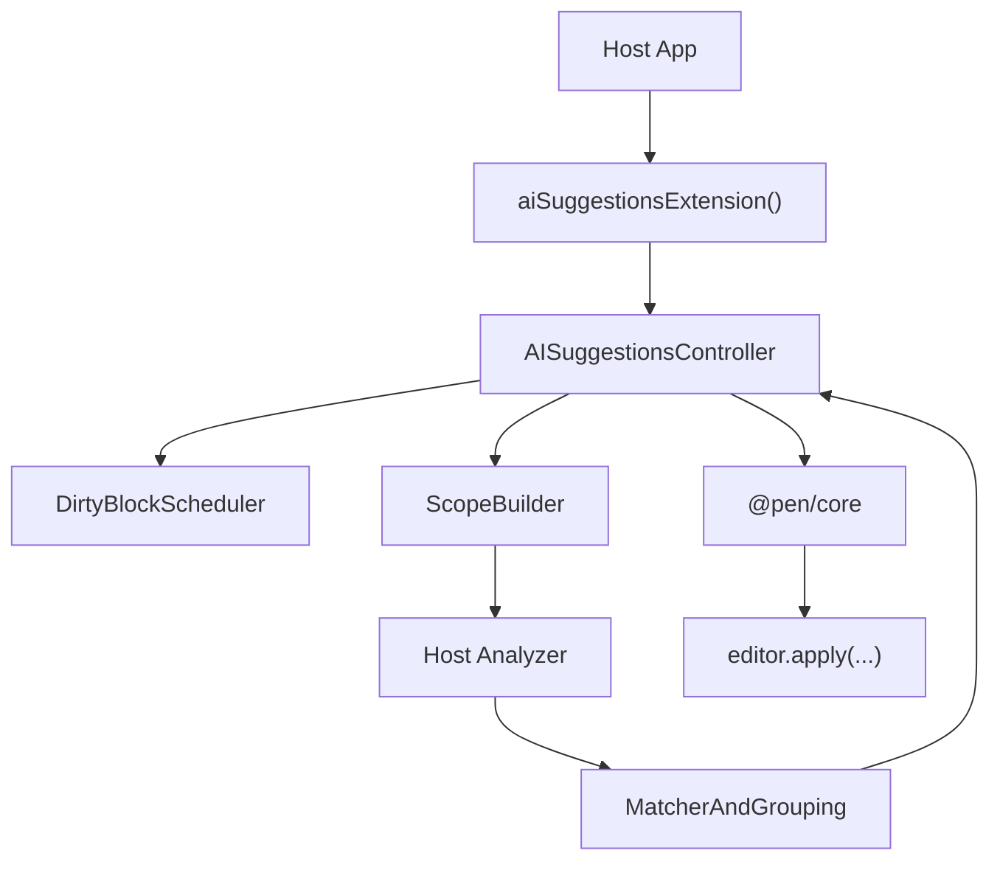

# @pen/ai-suggestions

## Purpose

Proactive AI writing suggestions for Pen.

## Public Role

`@pen/ai-suggestions` adds Grammarly-style suggestion behavior on top of the editor without changing Pen's mutation authority. It is a headless extension that detects eligible local edits, asks a host-provided analyzer for bounded suggestion candidates, stages those suggestions against live document ranges, and exposes controller state for renderer UIs.

The package is responsible for proactive suggestion lifecycle, not for renderer ownership or host-specific model policy.

## Key Exports / Entrypoints

- Export map: `.`
- Primary extension entrypoint: `aiSuggestionsExtension()`
- Controller slot and accessors: `AI_SUGGESTIONS_CONTROLLER_SLOT`, `getAISuggestionsController()`
- Host helpers: `resolveAISuggestionsConfig()`, `buildAISuggestionDecorations()`, `buildApplySuggestionOps()`
- Analyzer contract helpers: `AI_SUGGESTIONS_REQUEST_MODE`, `AI_SUGGESTIONS_SYSTEM_PROMPT`, `buildAISuggestionMessages()`, `analyzeSuggestionScope()`, `parseSuggestionResponse()`
- Workspace scripts: `build`, `clean`, `test`, `typecheck`

## Dependencies And Boundaries

- Runtime dependencies: `@pen/core`, `@pen/types`
- Peer dependencies: No peer dependencies declared.
- Boundary: The extension composes through editor slots, events, and decorations rather than renderer-specific side channels.

## Runtime Model

`@pen/ai-suggestions` stays local-first and bounded:

Important rules:

- Suggestions remain advisory until explicitly applied.
- Matching and apply must validate against live editor content before mutating.
- Scope building should stay bounded and cheap; hosts should not treat this package as a document-wide unrestricted rewrite surface.
- Renderer packages may read controller state and render UI, but renderer packages do not own the suggestion runtime contract.

## Suggestion Lifecycle

The current package stages proactive edits in a few explicit phases:

- User-originated document commits mark blocks dirty and feed the scheduler.
- The scheduler waits for debounce, stability, minimum changed characters, and per-block cooldown.
- Scope building extracts a sentence-level or bounded local scope around the change.
- A host analyzer returns structured candidates for that scope.
- Candidates are filtered by confidence, dismissal memory, cache reuse, and overlap rules before materialization.
- Materialized suggestions become inline decorations plus grouped popover state.
- Apply and dismiss actions resolve through explicit controller methods, preserving editor mutation authority and undo behavior.

## Integration Notes

- Path in workspace: `packages/extensions/ai-suggestions`
- Spec path mirrors workspace path: `packages/extensions/ai-suggestions.md`
- Typical integration installs `aiSuggestionsExtension({ analyzer })` on the editor and then uses renderer-specific primitives or hooks to expose UI
- `@pen/react` currently provides the main UI surface through `Pen.AISuggestions.Root`, `Pen.AISuggestions.Popover`, and related hooks
- Hosts should treat the controller as the source of truth for active suggestions, groups, metrics, and runtime tuning
- Playground integration is expected to exercise both the analyzer request path and the renderer lifecycle for underline, popover, apply, and dismiss behavior

## Current Maturity / Intended Usage

Workspace package at version `0.0.0`; intended usage is current-state but still evolving. The package is suitable for proactive writing assistance in host apps that can provide a bounded analyzer implementation and renderer UI.

## Non-goals

- Do not duplicate core editor mutation authority.
- Do not make the extension itself responsible for renderer presentation.
- Do not assume a specific model provider, backend transport, or host-side prompt policy.
- Do not allow unbounded whole-document rewrites to masquerade as proactive inline suggestions.
