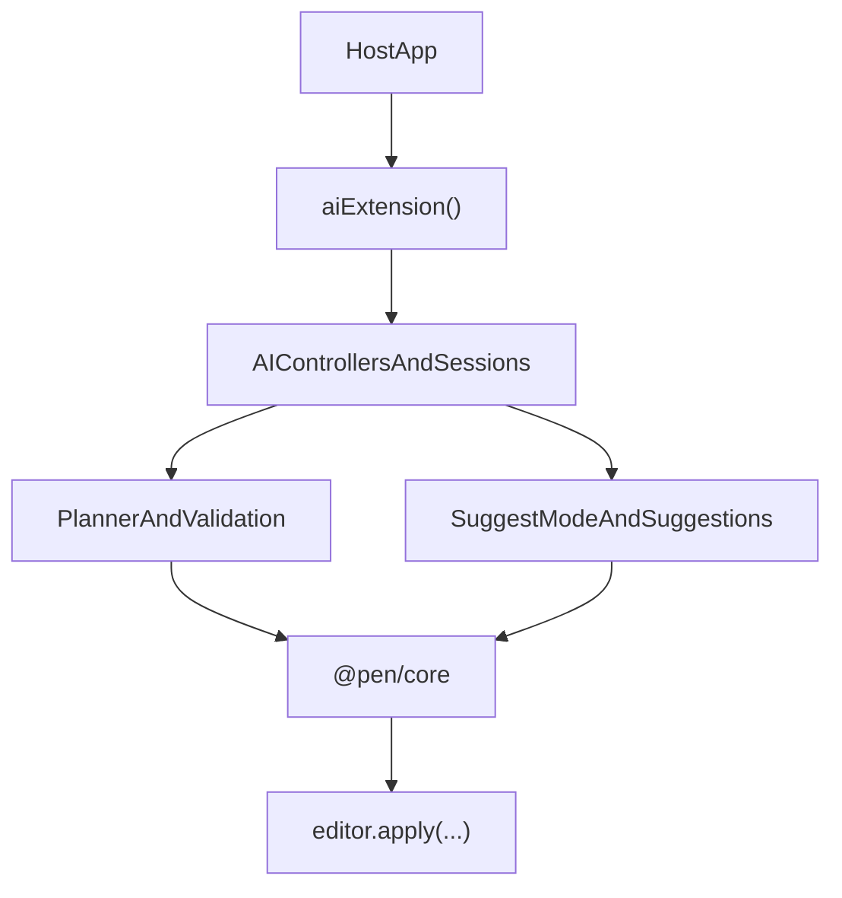

# @pen/ai

## Purpose

`@pen/ai` adds AI-oriented editor behavior to Pen: controller state, session orchestration, suggest mode, track-changes flows, review artifacts, contextual prompting, planner and execution helpers, and mutation receipts.

## Public Role

This package extends the editor with AI behavior without taking over document authority. It is responsible for orchestrating AI flows around the editor, not for replacing the editor mutation pipeline or becoming a renderer package.

In current usage, `@pen/ai` is the headless orchestration layer for both inline edits and chat-driven edits. It owns session lifecycle, target resolution, prompt sequencing, reviewable suggestion staging, and the translation from model output into bounded editor mutations.

## Key Exports / Entrypoints

- Export map: `.`
- Primary extension entrypoint: `aiExtension()`
- Slot and controller accessors such as `AI_CONTROLLER_SLOT`, `INLINE_COMPLETION_SLOT`, `getAIController()`, and related review/inline controllers
- Command surfaces such as `AICommandRegistry` and `defaultAICommands`
- Planner, contract, validation, and execution helpers for structured mutation flows
- Suggestion helpers such as `acceptSuggestion()`, `rejectSuggestion()`, `readAllSuggestions()`, and suggest-mode interceptors
- Rich AI types covering sessions, prompts, execution modes, previews, plans, receipts, and stream events
- Session surfaces for `inline-edit` and `bottom-chat`, including prompt history, turn tracking, and contextual prompt state
- Shared AI mutation contracts for selection-backed rewrites, scoped-range rewrites, block rewrites, and document transforms
- Workspace scripts: `build`, `clean`, `test`, `typecheck`

## Dependencies And Boundaries

- Runtime dependencies: `@pen/core`, `@pen/document-ops`, `@pen/types`
- Peer dependencies: No peer dependencies declared.
- Boundary: The extension composes through the core editor and slots/events rather than side channels.

## Runtime Model

`@pen/ai` wraps model-facing workflows around the editor rather than bypassing it:

Important rules:

- Model output still has to land through the editor runtime.
- Suggest mode and review flows are mutation-management features, not alternate document stores.
- Renderer packages consume AI controller state, but renderer packages do not own the AI runtime contract.
- Follow-up AI edits should reuse session context instead of treating each prompt as isolated.
- Inline edits and chat rewrites should converge on the same bounded mutation machinery whenever possible so streaming previews, diffs, and undo stay consistent.

## AI Mutation Contract

The current AI runtime resolves most rewrite behavior into explicit editor targets before streaming begins.

- Inline edits operate on live or pinned selections and stage reviewable suggestions against that selection.
- Chat rewrites that target a title, paragraph, or whole document are resolved into synthetic but explicit range targets rather than open-ended document narration.
- The preferred rewrite path is `rewrite-selection` with a target kind of either `selection` or `scoped-range`.
- `scoped-range` is used for synthetic scopes such as `heading`, `paragraph`, `block`, or `document` where the runtime still wants selection-like provenance and diff behavior.
- Conflict detection uses target provenance such as selection signatures, block revisions, synced generation, and source-text checks before final apply.
- Multi-block markdown rewrites stream as staged suggestions so users can review, accept, reject, and undo them like inline fast-apply flows.

## Session Behavior

Sessions are first-class runtime state, not renderer-local convenience state.

- Both `inline-edit` and `bottom-chat` sessions track turns, generation ids, prompt history, pending suggestions, and active turn state.
- Follow-up prompts should include recent session prompt history in the model-facing prompt so iterative edits remain sequence-aware.
- Inline edit sessions keep their target anchored even if the live selection changes after the prompt UI opened.
- Accepting or rejecting a session turn should cleanly resolve the staged suggestions associated with that turn.
- Undo should treat an accepted AI turn as one logical reversible action.

## Integration Notes

- Path in workspace: `packages/extensions/ai`
- Spec path mirrors workspace path: `packages/extensions/ai.md`
- Typical integration installs `aiExtension()` on the editor and then uses renderer-specific primitives or hooks to expose AI UI
- `@pen/react` provides the broadest AI UI surface today, but the extension itself stays headless
- `@pen/document-ops` is a key dependency because AI flows need document-tool and mutation preparation helpers
- Hosts should treat the controller as the source of truth for AI session state, review items, and pending suggestion lifecycle
- Renderer UIs may expose separate inline and chat surfaces, but both surfaces should flow through the same session and mutation contracts exposed here

## Current Maturity / Intended Usage

Workspace package at version `0.0.0`; intended usage is current-state but still evolving. This is one of the most ambitious packages in the workspace and should be treated as a large extension surface rather than a minimal helper package.

## Non-goals

- Do not duplicate core editor authority.
- Do not make the extension itself responsible for renderer UI ownership.
- Do not collapse transport, auth, or host-specific model policy into the package by default.
- Do not let chat-only or renderer-only mutation semantics drift away from the shared selection-backed execution model.
