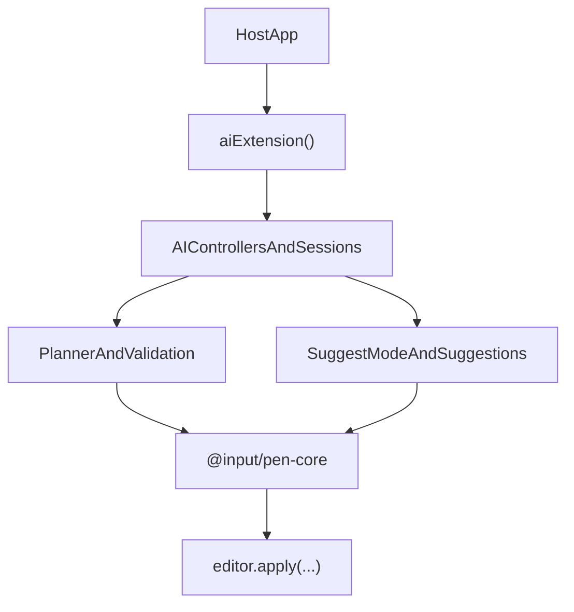

# @input/pen-ai

## Purpose

`@input/pen-ai` adds AI-oriented editor behavior to Pen: controller state, session orchestration, suggest mode, track-changes flows, review artifacts, contextual prompting, planner and execution helpers, mutation receipts, plus the suggestions, autocomplete, skills, tools, and stream surfaces on subpaths.

## Public Role

This package extends the editor with AI behavior without taking over document authority. It is responsible for orchestrating AI flows around the editor, not for replacing the editor mutation pipeline or becoming a renderer package.

In current usage, `@input/pen-ai` is the headless orchestration layer for both inline edits and chat-driven edits. It owns session lifecycle, target resolution, prompt sequencing, reviewable suggestion staging, and the translation from model output into bounded editor mutations. The five feature subpaths live in the same package so they share one egress seam and one dependency footprint.

## Key Exports / Entrypoints

- Export map: `.`, `./suggestions`, `./autocomplete`, `./skills`, `./tools`, `./stream`, `./package.json`
- Root: `aiExtension()`, controller accessors such as `getAIController()`, `getAIInlineCompletionController()`, `getAIInlineHistoryController()`, and `getAIReviewController()` — slot keys such as `AI_CONTROLLER_SLOT` and `INLINE_COMPLETION_SLOT` live on `@input/pen-types`
- Command surfaces such as `AICommandRegistry` and `defaultAICommands`
- Planner, contract, validation, and execution helpers for structured mutation flows
- Suggestion helpers such as `acceptSuggestion()`, `rejectSuggestion()`, `readAllSuggestions()`, and suggest-mode interceptors
- Rich AI types covering sessions, prompts, execution modes, previews, plans, receipts, and stream events
- Session surfaces for `inline-edit` and `bottom-chat`, including prompt history, turn tracking, and contextual prompt state
- Shared AI mutation contracts for selection-backed rewrites, scoped-range rewrites, block rewrites, and document transforms
- Egress re-exports: `aiEgressFacet`, `aiEgressExtension()`, `streamThroughEgress()` from `@input/pen-core`
- Workspace scripts: `build`, `clean`, `test`, `typecheck`

## Dependencies And Boundaries

- Runtime dependencies: `@input/pen-content-ops`, `@input/pen-core`, `@input/pen-document-ops`, `@input/pen-types`
- Peer dependencies: No peer dependencies declared.
- Boundary: The extension composes through the core editor and slots/events rather than side channels. Network egress is owned by core `pen.aiEgress`, not by a second filter chain in this package.

## Runtime Model

`@input/pen-ai` wraps model-facing workflows around the editor rather than bypassing it:

```mermaid
flowchart TD
  HostApp[HostApp]
  AIExt["aiExtension()"]
  Controllers[AIControllersAndSessions]
  Planner[PlannerAndValidation]
  Suggest[SuggestModeAndSuggestions]
  Core["@input/pen-core"]
  Apply["editor.apply(...)"]

  HostApp --> AIExt
  AIExt --> Controllers
  Controllers --> Planner
  Controllers --> Suggest
  Planner --> Core
  Suggest --> Core
  Core --> Apply
```

Important rules:

- Model output still has to land through the editor runtime.
- All model streams go through core `streamThroughEgress()` / `pen.aiEgress`. This package re-exports that helper; it does not keep a second filter chain.
- Suggest mode and review flows are mutation-management features, not alternate document stores.
- Suggest-mode interception matches on the ten `DocumentOp` primitives plus `origin.intent`. A split arrives as one apply with `intent: "pen.splitBlock"`; suggest-mode renders it as a split from the intent, not from a compound op type.
- Renderer packages consume AI controller state, but renderer packages do not own the AI runtime contract.
- Follow-up AI edits should reuse session context instead of treating each prompt as isolated.
- Inline edits and chat rewrites should converge on the same bounded mutation machinery whenever possible so streaming previews, diffs, and undo stay consistent.

## AI Mutation Contract

The current AI runtime resolves most rewrite behavior into explicit editor targets before streaming begins.

- Inline edits operate on live or pinned selections and stage reviewable suggestions against that selection.
- Chat rewrites that target a title, paragraph, or whole document are resolved into synthetic but explicit range targets rather than open-ended document narration.
- The preferred rewrite path is `rewrite-selection` with a target kind of either `selection` or `scoped-range`.
- `scoped-range` is used for synthetic scopes such as `heading`, `paragraph`, `block`, or `document` where the runtime still wants selection-like provenance and diff behavior.
- Conflict detection uses target provenance such as selection signatures, block revisions, synced generation, and source-text checks before final apply. Alignment compares folded text via core `foldAndNormalize()`, not `toLowerCase()`.
- Multi-block markdown rewrites stream as staged suggestions so users can review, accept, reject, and undo them like inline fast-apply flows.

## Session Behavior

Sessions are first-class runtime state, not renderer-local convenience state.

- Both `inline-edit` and `bottom-chat` sessions track turns, generation ids, prompt history, pending suggestions, and active turn state.
- Follow-up prompts should include recent session prompt history in the model-facing prompt so iterative edits remain sequence-aware.
- Inline edit sessions keep their target anchored even if the live selection changes after the prompt UI opened.
- Accepting or rejecting a session turn should cleanly resolve the staged suggestions associated with that turn.
- Undo should treat an accepted AI turn as one logical reversible action.

## Suggestions (`@input/pen-ai/suggestions`)

Proactive Grammarly-style writing suggestions. Headless: detects eligible local edits, asks a host-provided analyzer for bounded candidates, stages those suggestions against live document ranges, and exposes controller state for renderer UIs.

- `aiSuggestionsExtension()`, `getAISuggestionsController()` — slot key `AI_SUGGESTIONS_CONTROLLER_SLOT` lives on `@input/pen-types`
- Analyzer helpers on the barrel: `AI_SUGGESTIONS_REQUEST_MODE`, `AI_SUGGESTIONS_SYSTEM_PROMPT`, `buildAISuggestionMessages()`, `parseSuggestionResponse()`
- Analyzer requests stream through core `streamThroughEgress()` / `pen.aiEgress`
- Matching, cache fingerprints, and analyzer no-op checks fold text with core `foldAndNormalize()` and `localeFacet`
- Each materialized suggestion holds one `editor.anchors` range, minted at creation and repaired on content-move commits. Death is `resolve` returning `null` or `collapsed: true` after repair.
- Suggestions remain advisory until explicitly applied. Scope building stays bounded; this is not a document-wide unrestricted rewrite surface.
- `@input/pen-react` exposes UI through `Pen.AISuggestions.Root`, `Pen.AISuggestions.Popover`, and related hooks.

Lifecycle: user-originated commits mark blocks dirty; the scheduler waits for debounce, stability, minimum changed characters, and per-block cooldown; scope building extracts a sentence-level or bounded local scope; the host analyzer returns structured candidates; candidates are filtered by confidence, dismissal memory, cache reuse, and overlap; materialized suggestions become inline decorations plus grouped popover state; apply and dismiss go through the controller.

## Autocomplete (`@input/pen-ai/autocomplete`)

Low-latency inline ghost-text completion. The subpath owns request scheduling and controller state; it does not own the model filter chain.

- `autocompleteExtension()`, `getAutocompleteController()`, `createAutocompleteProvider()`, `builtinAutocompleteProviders()`, `AUTOCOMPLETE_SYSTEM_PROMPT`
- Completion requests stream through core `streamThroughEgress()` / `pen.aiEgress`
- The continuation target is one `editor.anchors` mint at request time, repaired on content-move commits, and resolved when the completion arrives

## Skills (`@input/pen-ai/skills`)

Agent skill artifacts for Pen AI tools.

- `listDefaultAISkills()`, `renderSkillFiles()`
- Types: `AISkillDefinition`, `AISkillFile`, `AISkillScript`

## Tools (`@input/pen-ai/tools`)

Canonical AI tool surface. Transports authorize a model-driven call before execution.

- `openAIToolCall()`, `executeAITool()`, `getAIToolRuntime()`, `listAITools()`, `authorizeAIToolCall()`, `createAIToolTurn()`
- `openAIToolCall()` authorizes a call and installs the write guard before the transport runs `executeAITool`. Transports must not call `executeAITool` unless the result is `{ ok: true }`.
- `close()` on that opened call restores the patched `editor.apply` and is idempotent: the first result is stored, and later calls return that same result. The write guard is restored in `finally`, not `catch`. A non-throw unwind (abandoning a stream mid-`yield`) runs `finally` and skips `catch`; a `catch`-only restore left the guard patched onto the host editor and silently dropped every later `editor.apply` editor-wide.
- The live `Editor` used for the guard is `ToolContext.editor` at construction. That is a local runtime field, not `PenStreamRequest.context.editor` (removed from the wire type).

## Stream (`@input/pen-ai/stream`)

Streaming protocol and processing pipeline. Optional runtime that turns a `PenStream` of parts into editor mutations. It is not installed by `createEditor()`. `defaultPreset()` is the path that includes it.

- `deltaStreamExtension()`, `processStream()`
- Install via `defaultPreset()` or `createEditor({ extensions: [deltaStreamExtension()] })`.
- Core `openTextStream` holds one `assoc: 1` local anchor as the write head; each flush repairs then resolves before splicing.

## Integration Notes

- Path in workspace: `packages/extensions/ai`
- Spec path mirrors workspace path: `packages/extensions/ai.md`
- Typical integration installs `aiExtension()` on the editor and then uses renderer-specific primitives or hooks to expose AI UI
- `@input/pen-react` provides the broadest AI UI surface today, but the extension itself stays headless
- `@input/pen-document-ops` is a key dependency because AI flows need document-tool and mutation preparation helpers
- Hosts should treat the controller as the source of truth for AI session state, review items, and pending suggestion lifecycle
- Renderer UIs may expose separate inline and chat surfaces, but both surfaces should flow through the same session and mutation contracts exposed here
- Playground integration exercises the analyzer request path and the renderer lifecycle for underline, popover, apply, and dismiss

## Current Maturity / Intended Usage

Workspace package at version `0.0.1`; intended usage is current-state but still evolving. This is one of the most ambitious packages in the workspace and should be treated as a large extension surface rather than a minimal helper package.

## Non-goals

- Do not duplicate core editor authority.
- Do not make the extension itself responsible for renderer UI ownership.
- Do not collapse transport, auth, or host-specific model policy into the package by default.
- Do not let chat-only or renderer-only mutation semantics drift away from the shared selection-backed execution model.
- Do not assume a specific model provider, backend transport, or host-side prompt policy.
- Do not allow unbounded whole-document rewrites to masquerade as proactive inline suggestions.
