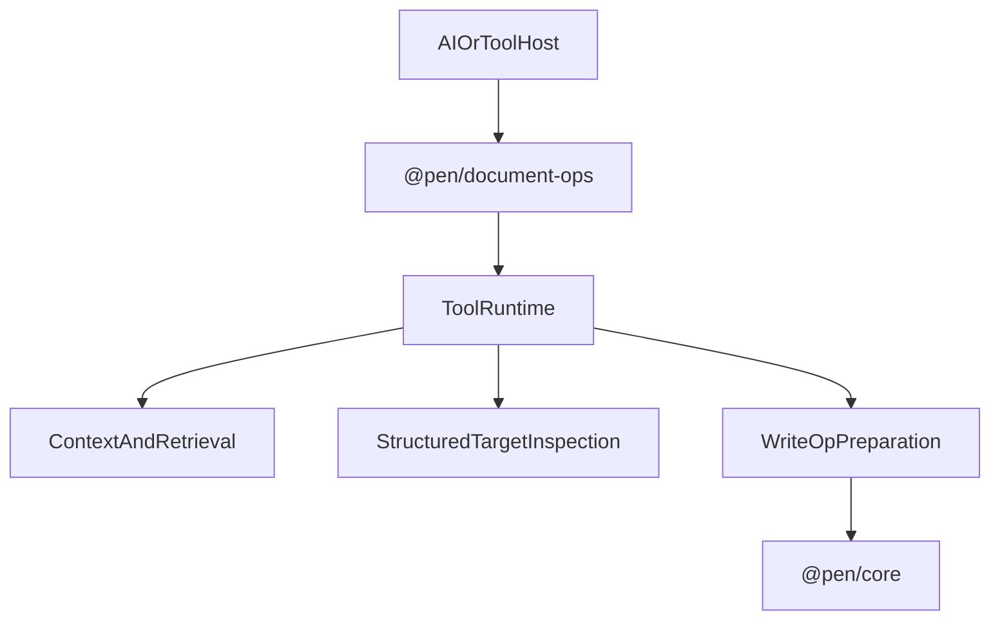

# @pen/document-ops

## Purpose

`@pen/document-ops` provides the document tool/runtime layer for Pen. It exposes block CRUD tools, document context and retrieval helpers, structured target inspection, and shared tool runtime plumbing for systems that need to read from or write to the document programmatically.

## Public Role

This package is the bridge between Pen's headless editor and tool-driven execution flows such as AI actions or external command surfaces. It does not own document truth, but it gives higher-level systems a safe, schema-aware way to inspect targets, retrieve context, and build valid document mutations.

## Key Exports / Entrypoints

- Export map: `.`
- Primary extension entrypoint: `documentOpsExtension()`
- Tool runtime slot and accessors such as `DOCUMENT_OPS_TOOL_RUNTIME_SLOT` and `getDocumentToolRuntime()`
- Runtime plumbing such as `ToolRuntimeImpl` and `ToolContextImpl`
- Context helpers such as `buildCursorContext()`, `resolveDocumentBlocks()`, `exportDocumentRangeAsMarkdown()`, `resolveSelectedText()`, and retrieval helpers
- Structured-target helpers such as `inspectStructuredTarget()`, `listValidOperationsForTarget()`, and block-type policy helpers
- Re-exported shared write helper: `buildDocumentWriteOps()`
- Workspace scripts: `build`, `clean`, `test`, `typecheck`

## Dependencies And Boundaries

- Runtime dependencies: `@pen/content-ops`, `@pen/markdown-serialization`, `@pen/types`
- Peer dependencies: No peer dependencies declared.
- Boundary: This package owns tool-facing document inspection and mutation preparation, but it does not replace the core mutation pipeline or renderer layer.

## Runtime Model

`@pen/document-ops` wraps editor-aware tools around shared write and context utilities:

Important rules:

- Tool-facing operations still resolve back into editor mutations.
- Context retrieval and structured target inspection should stay explicit and bounded so tools do not mutate blindly.
- Shared write-op construction comes from `@pen/content-ops`; this package owns the editor-aware tooling boundary built around it.

## Integration Notes

- Path in workspace: `packages/extensions/document-ops`
- Spec path mirrors workspace path: `packages/extensions/document-ops.md`
- Install `documentOpsExtension()` when a host needs a registered tool runtime for read/write/context operations against a live editor
- Use the inspection and policy helpers before mutating structured targets like tables or databases
- This package is especially important for AI and automation flows because it centralizes the safe document-tool contract

## Current Maturity / Intended Usage

Workspace package at version `0.0.0`; intended usage is current-state but still evolving. It already has an outsized architectural role because it defines how non-human actors interact with Pen documents without bypassing editor boundaries.

## Non-goals

- Do not duplicate core editor authority.
- Do not let tool runtimes mutate the document without schema-aware preparation and policy checks.
- Do not move renderer ownership or transport-specific orchestration into this package.
