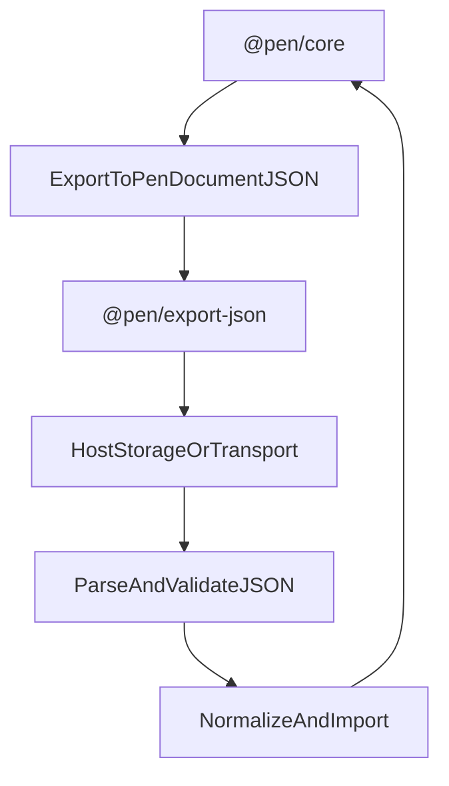

# @pen/export-json

## Purpose

`@pen/export-json` provides JSON export and import for Pen. It defines the structured interchange shape for Pen documents, including document versioning, block trees, inline content, marks, and optional metadata.

## Public Role

This package is the canonical structured serialization boundary for Pen. It does not replace `@pen/core`, but it is the main package that turns editor state into portable structured data and turns structured data back into importable editor operations.

## Key Exports / Entrypoints

- Export map: `.`
- Export APIs such as `jsonExporter` and `exportEditorToJson()`
- Import APIs such as `jsonImporter` and `parseJsonDocument()`
- Schema/version helpers such as `PEN_DOCUMENT_JSON_VERSION` and `isSupportedPenDocumentVersion()`
- Public JSON model types such as `PenDocumentJSON`, `PenBlockJSON`, `PenInlineContentJSON`, `PenMarkJSON`, and export option types
- Workspace scripts: `build`, `clean`, `test`, `typecheck`

## Dependencies And Boundaries

- Runtime dependencies: `@pen/content-ops`, `@pen/markdown-serialization`, `@pen/types`
- Peer dependencies: No peer dependencies declared.
- Boundary: This package serializes and prepares import/export flows, but it does not become an alternate editor runtime.

## Runtime Model

`@pen/export-json` sits just outside the editor runtime and converts between editor state and a stable document envelope:

Important rules:

- Export reads from the editor's current document state, including root blocks and structured children.
- Import parses JSON, validates version and shape, normalizes pending blocks against the current schema and document profile, and only then applies editor operations.
- The JSON envelope is a transport and persistence shape, not a second runtime authority.

## Integration Notes

- Path in workspace: `packages/extensions/export-json`
- Spec path mirrors workspace path: `packages/extensions/export-json.md`
- `exportEditorToJson()` is the lowest-friction way to persist a Pen document in a structured form
- `jsonImporter.import()` is the higher-level path when the goal is to apply imported content into a live editor
- This package is a foundational dependency for other structured interchange formats in the repo

## Current Maturity / Intended Usage

Workspace package at version `0.0.0`; intended usage is current-state but still evolving. Despite the version, this package already plays an outsized role because it effectively defines Pen's explicit structured document contract.

## Non-goals

- Do not duplicate core editor authority.
- Do not treat parsed JSON as trusted runtime state before validation and normalization.
- Do not move renderer concerns or UI flows into the serialization layer.
