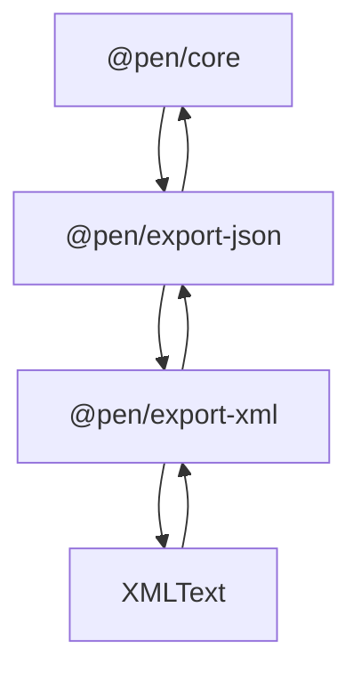

# @pen/export-xml

## Purpose

`@pen/export-xml` provides XML export and import for Pen. It offers a text-based structured interchange format for environments that prefer XML while preserving the same logical document model used by Pen JSON.

## Public Role

This package is a secondary interchange layer built on top of `@pen/export-json`. Its job is to serialize and parse an XML representation of the Pen document envelope, then hand off to the JSON import/export layer instead of creating a separate mutation or schema system.

## Key Exports / Entrypoints

- Export map: `.`
- Export APIs such as `xmlExporter` and `serializePenDocumentToXml()`
- Import APIs such as `xmlImporter` and `parseXmlDocument()`
- Public XML model and option types such as `PenXmlDocument` and `XmlExporterExtraOptions`
- Workspace scripts: `build`, `clean`, `test`, `typecheck`

## Dependencies And Boundaries

- Runtime dependencies: `@pen/export-json`, `@pen/types`, `domhandler`, `htmlparser2`
- Peer dependencies: No peer dependencies declared.
- Boundary: This package owns XML syntax, not a second document model or import pipeline.

## Runtime Model

`@pen/export-xml` is intentionally layered on top of the JSON document shape:

Important rules:

- XML export first derives the canonical Pen JSON document shape, then serializes that shape into XML.
- XML import parses the XML document into the Pen JSON envelope, then delegates actual import application to `jsonImporter`.
- XML is a transport syntax choice, not a divergent runtime contract.

## Integration Notes

- Path in workspace: `packages/extensions/export-xml`
- Spec path mirrors workspace path: `packages/extensions/export-xml.md`
- Use this package when a host or integration specifically needs XML files or XML-based interchange
- Prefer `@pen/export-json` as the conceptual starting point when reasoning about data shape; XML should stay aligned with that shape
- `htmlparser2` and `domhandler` are implementation details for parsing, not signals that this package should grow into a general HTML/XML document engine

## Current Maturity / Intended Usage

Workspace package at version `0.0.0`; intended usage is current-state but still evolving. The package is intentionally smaller than `@pen/export-json` because it should stay thin and derivative rather than becoming a competing serialization center.

## Non-goals

- Do not duplicate the JSON document contract.
- Do not create a separate XML-specific mutation pipeline.
- Do not pull renderer concerns or host-app XML policy into this package by default.
