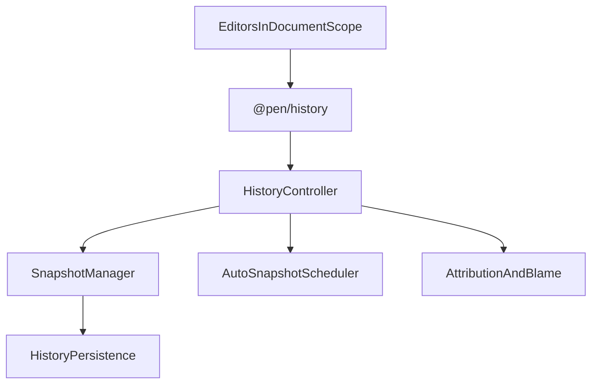

# @pen/history

## Purpose

`@pen/history` provides snapshot history, restore flows, and attribution primitives for Pen. It manages version snapshots, auto-snapshot scheduling, cross-editor restore coordination, and blame-style author attribution views.

## Public Role

This package adds document-history capabilities around the editor without replacing the live mutation pipeline. Its job is to persist and restore versioned document states, expose history controller state, and derive attribution views from recorded history-related data.

## Key Exports / Entrypoints

- Export map: `.`
- Primary extension entrypoint: `historyExtension()`
- Controller slot and accessors such as `HISTORY_CONTROLLER_SLOT` and `getHistoryController()`
- Runtime controller: `HistoryControllerImpl`
- Snapshot primitives such as `SnapshotManager` and `AutoSnapshotScheduler`
- Attribution helpers such as `getCharacterAttribution()`, `buildBlameRanges()`, and `resolveHistoryAuthor()`
- Public history types covering config, controller state, authors, blame ranges, and auto-snapshot options
- Workspace scripts: `build`, `clean`, `test`, `typecheck`

## Dependencies And Boundaries

- Runtime dependencies: `@pen/types`
- Peer dependencies: No peer dependencies declared.
- Boundary: This package owns snapshot orchestration and attribution views, but it does not become the live document runtime or undo stack.

## Runtime Model

`@pen/history` operates at document-scope level and coordinates multiple attached editors when restoring or listing snapshots:

Important rules:

- Snapshots are versioned document states, not incremental undo entries.
- Restore flows coordinate across editors in the same document scope and wait for extension lifecycle settling after restoration.
- Attribution and blame views are derived history features layered on top of stored version information.

## Integration Notes

- Path in workspace: `packages/extensions/history`
- Spec path mirrors workspace path: `packages/extensions/history.md`
- Install `historyExtension()` when a host needs version snapshots, restore flows, or attribution tooling
- This package is complementary to `@pen/undo`: snapshots are for durable version history, while undo is for local reversible editing operations
- Hosts should treat persistence configuration as a boundary concern supplied to the package, not something the package invents internally

## Current Maturity / Intended Usage

Workspace package at version `0.0.0`; intended usage is current-state but still evolving. It is an important architectural package because it defines how Pen treats durable history across single-editor and multi-editor document scopes.

## Non-goals

- Do not duplicate the live editor mutation pipeline.
- Do not conflate snapshot history with local undo/redo semantics.
- Do not pull renderer UI ownership or persistence product decisions into the package by default.
