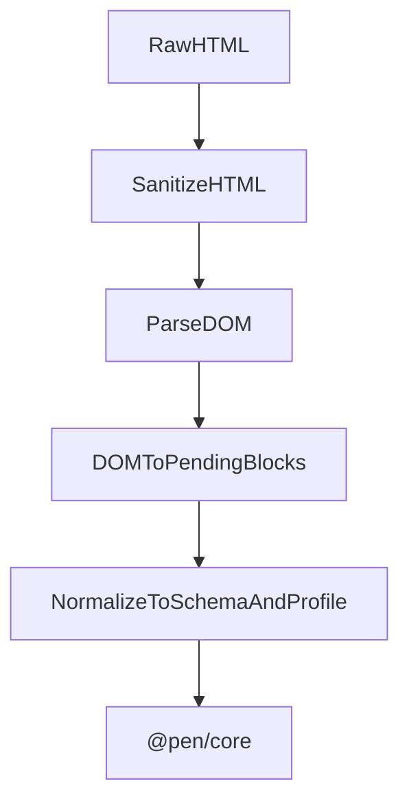

# @pen/import-html

## Purpose

`@pen/import-html` imports HTML into Pen. It sanitizes untrusted markup, parses the DOM into pending blocks and inline content, normalizes those blocks against the active schema and document profile, and then applies them through the editor.

## Public Role

This package is Pen's main external-rich-content ingest boundary for HTML. Its job is not just format conversion, but safe conversion: it turns arbitrary markup into a bounded subset that Pen can reason about and import without trusting the source document.

## Key Exports / Entrypoints

- Export map: `.`
- Import APIs such as `htmlImporter` and `parseHtmlToBlocks()`
- Sanitization API: `sanitizeHTML()`
- Workspace scripts: `build`, `clean`, `test`, `typecheck`

## Dependencies And Boundaries

- Runtime dependencies: `@pen/core`, `@pen/types`, `domhandler`, `htmlparser2`, `isomorphic-dompurify`
- Peer dependencies: No peer dependencies declared.
- Boundary: This package owns safe HTML ingestion and mapping into Pen blocks, but it does not become a renderer or a second editor runtime.

## Runtime Model

HTML import is intentionally staged so untrusted input is sanitized before it ever becomes importable content:

Important rules:

- Treat HTML input as untrusted.
- Sanitize first, then parse, then normalize against the active editor schema and document profile.
- Imported content only becomes document state after conversion into operations and `editor.apply(...)`.

## Integration Notes

- Path in workspace: `packages/extensions/import-html`
- Spec path mirrors workspace path: `packages/extensions/import-html.md`
- `parseHtmlToBlocks()` is useful when a host wants parsed pending blocks without immediately applying them
- `htmlImporter.import()` is the higher-level path for live-editor insertion and replacement flows
- The sanitization policy is part of the package's contract and should stay intentionally conservative

## Current Maturity / Intended Usage

Workspace package at version `0.0.0`; intended usage is current-state but still evolving. This package is security-sensitive because it handles untrusted markup, so boundary clarity matters more here than in most format helpers.

## Non-goals

- Do not duplicate core editor authority.
- Do not trust source HTML as already safe or schema-valid.
- Do not grow into a general-purpose browser rendering or DOM manipulation package.
