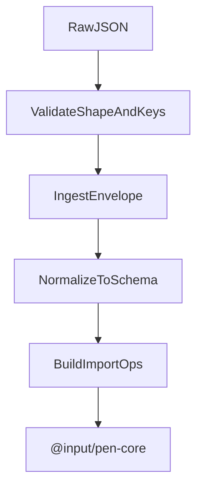

# @input/pen-import-json

## Purpose

`@input/pen-import-json` imports a Pen JSON document into an editor. It validates the payload, applies the shared ingest envelope, and then converts surviving blocks into operations.

## Public Role

This is the dedicated JSON *ingest* package. `@input/pen-export-json` still ships its own `jsonImporter` for round-trip tests and XML handoff. Hosts that want ingest bounds and proto-key rejection should use this package.

## Key Exports / Entrypoints

- Export map: `.`
- Import APIs: `jsonImporter`, `parseJsonToBlocks()`, `parseJsonWithReport()`
- Ingest-envelope constants and `IngestReport` types
- Workspace scripts: `build`, `clean`, `test`, `typecheck`

## Dependencies And Boundaries

- Runtime dependencies: `@input/pen-content-ops`, `@input/pen-types`
- Peer dependencies: No peer dependencies declared.
- Boundary: This package owns JSON ingest. It does not export JSON.

## Runtime Model

Important rules:

- Treat JSON input as untrusted.
- Unknown block types and unknown props are dropped. Own keys `__proto__`, `constructor`, and `prototype` are rejected anywhere in the payload. Validation builds fresh null-prototype records; it does not deep-merge parsed JSON.
- The same local ingest-envelope numbers (depth, node count, text size, image count) live here, in import-html, and in import-markdown. They are copies, not a shared module.
- Imported content only becomes document state after `blocksToOps()` and `editor.apply(...)`.
- URLs are not pre-laundered here.

## Integration Notes

- Path in workspace: `packages/extensions/import-json`
- Spec path mirrors workspace path: `packages/extensions/import-json.md`
- `parseJsonToBlocks()` / `parseJsonWithReport()` are useful when a host wants pending blocks without applying them
- `jsonImporter.import()` is the live-editor path
- This package contributes no facets and no commands

## Current Maturity / Intended Usage

Workspace package at version `0.0.0`; intended usage is current-state but still evolving.

## Non-goals

- Do not duplicate core editor authority.
- Do not treat this package as the JSON export surface.
- Do not assume `@input/pen-export-json`'s importer applies the same ingest envelope.
