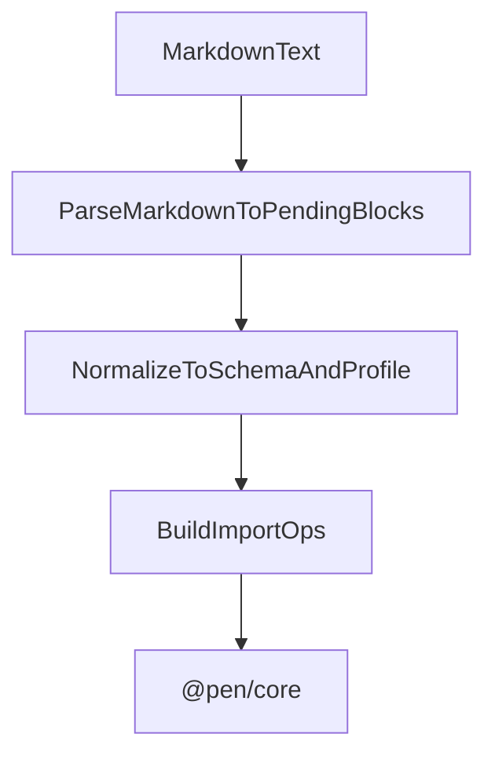

# @pen/import-markdown

## Purpose

`@pen/import-markdown` imports Markdown into Pen. It parses markdown into pending blocks, normalizes those blocks against the active schema and document profile, and applies the resulting operations through the editor runtime.

## Public Role

This package is the main plain-text authoring ingest layer for Pen. It handles Markdown as content that needs structural interpretation and normalization before it can become editor state, but without the HTML-specific sanitization concerns of raw markup import.

## Key Exports / Entrypoints

- Export map: `.`
- Import APIs such as `markdownImporter` and `parseMarkdownToBlocks()`
- Workspace scripts: `build`, `clean`, `test`, `typecheck`

## Dependencies And Boundaries

- Runtime dependencies: `@pen/content-ops`, `@pen/types`
- Peer dependencies: No peer dependencies declared.
- Boundary: This package owns Markdown-to-Pen conversion and import orchestration, but it does not replace the core mutation pipeline.

## Runtime Model

Markdown import is a parse, normalize, and apply flow:

Important rules:

- Markdown parsing produces pending blocks, not final document truth.
- The current editor schema and document profile still decide what survives normalization.
- Imported Markdown lands through editor operations and `editor.apply(...)`, preserving the core authority boundary.

## Integration Notes

- Path in workspace: `packages/extensions/import-markdown`
- Spec path mirrors workspace path: `packages/extensions/import-markdown.md`
- `parseMarkdownToBlocks()` is useful when hosts want to inspect or transform parsed blocks before insertion
- `markdownImporter.import()` is the higher-level path for inserting or replacing content in a live editor
- This package depends on `@pen/content-ops` because the markdown parsing primitives live there, while this package owns the integration boundary into editor import flows

## Current Maturity / Intended Usage

Workspace package at version `0.0.0`; intended usage is current-state but still evolving. It is simpler than HTML import in threat model, but still architecturally important because it shows how text-based importers should remain schema-aware and mutation-safe.

## Non-goals

- Do not duplicate core editor authority.
- Do not assume parsed Markdown is already valid for the active schema or profile.
- Do not mix renderer concerns or toolbar/editor UX into the import package.
