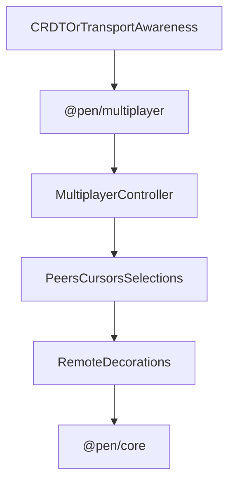

# @pen/multiplayer

## Purpose

`@pen/multiplayer` provides multiplayer presence and sync primitives for Pen. It manages connection state, peer identity resolution, remote cursor and selection state, author ledgers, and renderer-facing remote decorations.

## Public Role

This package adds collaboration awareness around the editor without turning itself into the document authority. Its main role is to project remote user state into Pen's headless runtime and UI surfaces while leaving actual document mutation truth to the core and CRDT layers underneath.

## Key Exports / Entrypoints

- Export map: `.`
- Primary extension entrypoint: `multiplayerExtension()`
- Controller slot and accessors such as `MULTIPLAYER_CONTROLLER_SLOT` and `getMultiplayerController()`
- Runtime controller: `MultiplayerControllerImpl`
- Presence helpers such as `AuthorLedger`, `ClientIdentityMap`, `assignMultiplayerColor()`, and `normalizeMultiplayerColor()`
- Public multiplayer state and snapshot types covering users, peers, cursors, selections, and session context
- Workspace scripts: `build`, `clean`, `test`, `typecheck`

## Dependencies And Boundaries

- Runtime dependencies: `@pen/core`, `@pen/types`
- Peer dependencies: No peer dependencies declared.
- Boundary: This package owns collaboration awareness and renderer-facing remote state, but it does not replace core mutation authority or the underlying CRDT transport.

## Runtime Model

`@pen/multiplayer` turns awareness state into Pen controller state and remote decorations:

Important rules:

- Remote presence is collaboration state, not document truth.
- Remote cursor and selection visuals are derived from controller state and emitted as decorations.
- Identity resolution and author ledgers should enrich collaboration state without coupling the package to one transport provider.

## Integration Notes

- Path in workspace: `packages/extensions/multiplayer`
- Spec path mirrors workspace path: `packages/extensions/multiplayer.md`
- Install `multiplayerExtension()` when a host app wants collaboration presence, remote cursors, or remote selection rendering
- Renderers consume controller state and decorations; they should not reimplement peer-tracking logic locally
- The package is designed to sit above transport or CRDT awareness feeds rather than own networking itself

## Current Maturity / Intended Usage

Workspace package at version `0.0.0`; intended usage is current-state but still evolving. It is already an important architectural layer because it defines how collaboration presence becomes editor-visible state without collapsing transport and rendering into one package.

## Non-goals

- Do not duplicate core editor authority.
- Do not make the package itself responsible for networking or transport session orchestration.
- Do not let remote presence state become a substitute for the canonical document model.
