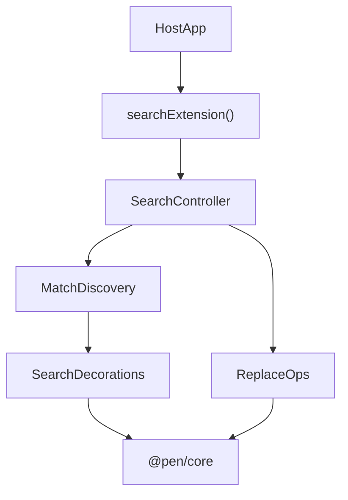

# @pen/search

## Purpose

`@pen/search` provides headless document search and replacement behavior for Pen, including controller state, match discovery, navigation helpers, replacement op builders, and extension wiring.

## Public Role

This package adds optional search behavior to an editor instance without coupling search to any one renderer. UI packages can render search controls, but the controller, match calculation, and replace operations live here.

## Key Exports / Entrypoints

- Export map: `.`
- Primary extension entrypoint: `searchExtension()`
- Controller slot and lookup helpers such as `SEARCH_CONTROLLER_SLOT` and `getSearchController()`
- Search controller runtime: `SearchControllerImpl`
- Pure helpers such as `buildSearchRegex()`, `findDocumentMatches()`, `revealActiveMatch()`, `buildReplaceOps()`, and `buildReplaceAllOps()`
- Search state and typing such as `SearchState`, `SearchMatch`, and `SearchOptions`
- Workspace scripts: `build`, `clean`, `test`, `typecheck`

## Dependencies And Boundaries

- Runtime dependencies: `@pen/core`, `@pen/types`
- Peer dependencies: No peer dependencies declared.
- Boundary: The extension composes through the core editor and slots/events rather than side channels.

## Runtime Model

Search is a classic headless extension: it derives state from the current document, exposes controller state, and builds mutations for replacements when asked:

Important rules:

- Search state is derived from the current editor document and options.
- Active-match navigation is controller state, not renderer-local state.
- Replace and replace-all actions resolve to editor operations instead of direct DOM mutations.

## Integration Notes

- Path in workspace: `packages/extensions/search`
- Spec path mirrors workspace path: `packages/extensions/search.md`
- Typical integration installs `searchExtension()` on the editor and renders controls from `@pen/react` or another renderer package
- Decorations and active-match reveal behavior should remain extension-driven so closing or resetting search can fully clear search-derived state
- Keyboard shortcuts belong at the renderer or host-app layer, but they should call back into the search controller here

## Current Maturity / Intended Usage

Workspace package at version `0.0.0`; intended usage is current-state but still evolving. The package is small in surface area relative to `@pen/ai`, but it is important because it establishes the correct pattern for headless feature packages with renderer-agnostic UI.

## Non-goals

- Do not duplicate core editor authority.
- Do not embed renderer-specific UI inside the extension.
- Do not treat DOM highlight state as the source of truth instead of controller and decoration state.
