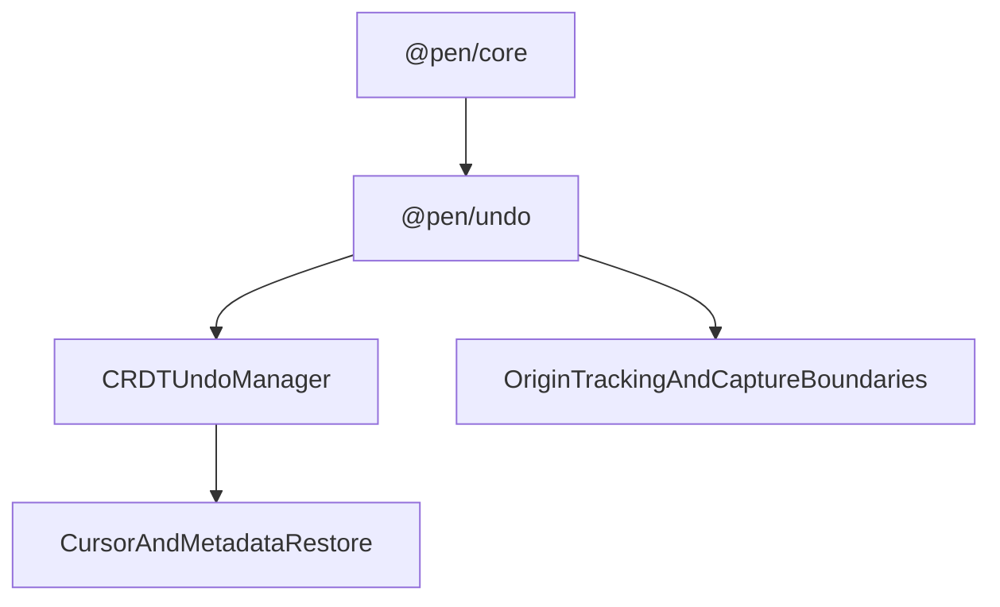

# @pen/undo

## Purpose

`@pen/undo` provides undo/redo behavior for Pen on top of the CRDT adapter. It manages tracked origins, capture boundaries, explicit undo groups, cursor restoration metadata, and renderer-facing history restore coordination.

## Public Role

This package is the reversible-editing layer for live editing sessions. It does not replace `editor.apply(...)`, but it governs which applied operations are grouped, which origins are tracked, and how undo/redo restores editor selection and related metadata.

## Key Exports / Entrypoints

- Export map: `.`
- Primary extension entrypoint: `undoExtension()`
- Runtime manager: `UndoManagerImpl`
- Public options surface: `UndoExtensionOptions`
- Workspace scripts: `build`, `clean`, `test`, `typecheck`

## Dependencies And Boundaries

- Runtime dependencies: `@pen/types`
- Peer dependencies: No peer dependencies declared.
- Boundary: This package owns undo/redo orchestration around the CRDT undo manager, but it does not become the editor mutation authority.

## Runtime Model

`@pen/undo` wraps the underlying CRDT undo stack and adds Pen-specific grouping and restore semantics:

Important rules:

- Undo and redo operate on previously applied operations; they do not bypass the core mutation path.
- Origins matter: the package decides which operation origins are tracked and how explicit undo groups change capture behavior.
- Cursor and metadata restoration are part of the package contract so history operations restore editor state, not just document bytes.

## Integration Notes

- Path in workspace: `packages/extensions/undo`
- Spec path mirrors workspace path: `packages/extensions/undo.md`
- Install `undoExtension()` when a host wants live reversible editing semantics with Pen's origin-aware grouping
- Treat `trackedOrigins` and group boundaries as part of the editing architecture, not just UX polish
- This package complements `@pen/history`: undo is short-horizon reversible editing, while history is durable snapshot/version management

## Current Maturity / Intended Usage

Workspace package at version `0.0.0`; intended usage is current-state but still evolving. Even so, it is already a subtle package because grouping and restore behavior shape how editing feels across typing, paste, AI operations, and collaboration-aware origins.

## Non-goals

- Do not duplicate core document authority.
- Do not treat undo stacks as durable version history.
- Do not push renderer-specific keyboard handling or UI composition into the undo package.
