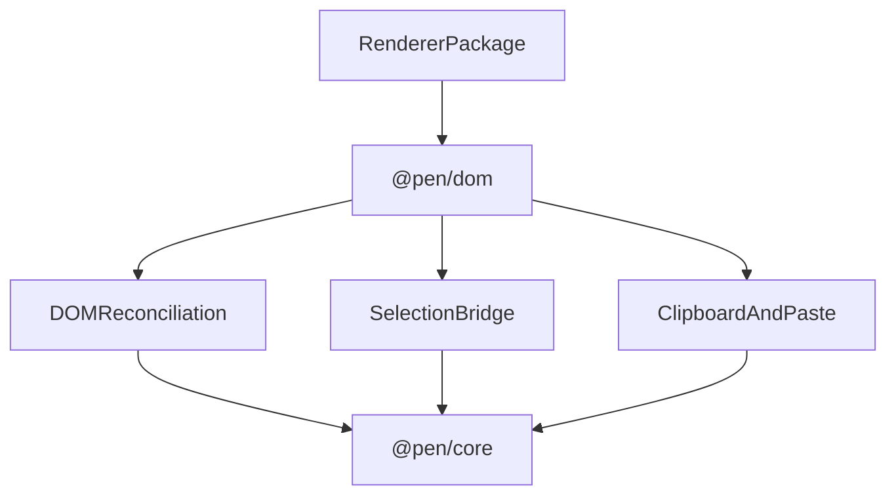

# @pen/dom

## Purpose

`@pen/dom` provides the shared DOM field-editor engine and low-level DOM reconciliation helpers used by Pen renderers. It is the package that turns editor state into browser editing behavior without tying that behavior to React or Vue.

## Public Role

This package sits between `@pen/core` and renderer packages. It owns DOM-specific editing concerns like reconciliation, selection bridging, clipboard handling, and select-all behavior, while leaving component structure and framework lifecycle to the renderer layer.

## Key Exports / Entrypoints

- Export map: `.`, `./field-editor`, `./field-editor/*`, `./constants/selectAll`, `./types/paste`, `./utils/dataAttributes`, `./utils/inlineDecorations`, `./utils/parentIdTree`
- Root exports such as `FieldEditorImpl`, `FieldEditorSession`, `resolveSelectAllBehavior()`, and `PasteImporters`
- Field-editor exports such as `fullReconcileToDOM()`, `applyDeltaToDOM()`, selection bridge helpers, cross-block selection helpers, and clipboard handlers
- DOM utility subpaths for renderer packages that need shared data-attribute or decoration helpers
- Workspace scripts: `build`, `clean`, `test`, `typecheck`

## Dependencies And Boundaries

- Runtime dependencies: `@pen/core`, `@pen/shortcuts`, `@pen/types`
- Peer dependencies: No peer dependencies declared.
- Boundary: `@pen/dom` sits between the core runtime and framework bindings and should remain framework-agnostic.

## Runtime Model

`@pen/dom` is the browser editing engine that both reads from and writes back to the headless editor:

Important rules:

- DOM selection is a view-layer representation and must stay synchronized with editor selection.
- Clipboard and typing flows resolve back into editor mutations instead of mutating the document model directly.
- Shared keyboard or select-all behavior belongs here when it is DOM-engine behavior, not framework-specific UI behavior.

## Integration Notes

- Path in workspace: `packages/rendering/dom`
- Spec path mirrors workspace path: `packages/rendering/dom.md`
- Renderer packages should depend on this package instead of each reimplementing selection bridging or reconciliation
- The `./field-editor` subpath is the main surface for renderer authors who need lower-level control
- This package should stay small in conceptual scope even if its internals are complex, because it is a boundary package rather than a product surface

## Current Maturity / Intended Usage

Workspace package at version `0.0.0`; intended usage is current-state but still evolving. It is now a key architectural package because it proves the shared editing engine can outlive any single framework renderer.

## Non-goals

- Do not put React- or Vue-specific component abstractions here.
- Do not let DOM convenience code become a second source of document truth.
- Do not collapse host-app keyboard UX, app chrome, or renderer composition into the field-editor engine.
