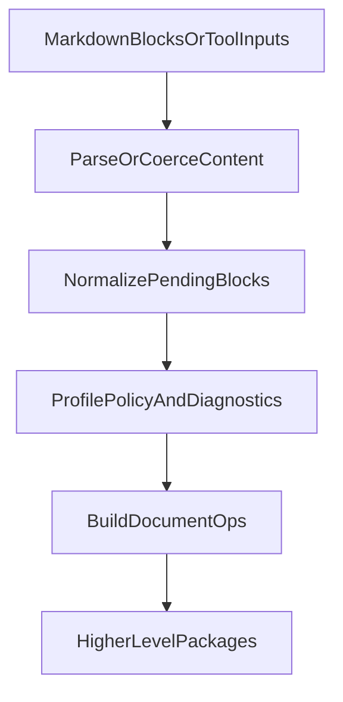

# @pen/content-ops

## Purpose

`@pen/content-ops` provides shared parsing, normalization, and operation-building helpers for Pen. It is where Markdown-to-block parsing, pending-block normalization, profile-policy filtering, and generic write-op construction live.

## Public Role

This package is a lower-level transformation layer used by higher-level import, AI, and document-tooling packages. It sits between raw content formats and editor-ready operations, but it does not own the editor runtime or end-user renderer surfaces.

## Key Exports / Entrypoints

- Export map: `.`
- Block operation helpers such as `blocksToOps()`
- Import normalization helpers such as `normalizePendingBlocksForImport()`, `filterPendingBlocksForDocumentProfile()`, `createImportResult()`, and diagnostic reporting helpers
- Markdown parsing entrypoint: `parseMarkdownToBlocks()`
- Generic write helper: `buildDocumentWriteOps()`
- Structured target and plan normalization helpers for tooling and AI-oriented write flows
- Workspace scripts: `build`, `clean`, `test`, `typecheck`

## Dependencies And Boundaries

- Runtime dependencies: `@pen/types`, `htmlparser2`, `mdast-util-from-markdown`, `mdast-util-gfm`, `micromark-extension-gfm`
- Peer dependencies: No peer dependencies declared.
- Boundary: `@pen/content-ops` is a shared transformation library and should not become an end-user entrypoint or runtime authority package.

## Runtime Model

`@pen/content-ops` turns content-like inputs into normalized pending blocks and operation lists that higher-level packages can safely apply:

Important rules:

- Pending blocks are intermediate structures, not final editor truth.
- Schema and document-profile policy still decide what survives normalization.
- This package prepares operations and diagnostics, but a higher-level package still decides when to call `editor.apply(...)`.

## Integration Notes

- Path in workspace: `packages/shared/content-ops`
- Spec path mirrors workspace path: `packages/shared/content-ops.md`
- Use this package when building importers, AI/document tools, or structured write flows that need schema-aware normalization before mutation
- `buildDocumentWriteOps()` is especially important because it unifies text, markdown, and block-shaped write inputs behind one normalization path
- Keep package consumers responsible for runtime application, undo grouping, and UI affordances

## Current Maturity / Intended Usage

Workspace package at version `0.0.0`; intended usage is current-state but still evolving. It is already a high-leverage package because many higher-level features depend on its normalization and write-op rules staying stable.

## Non-goals

- Do not leak product-facing abstractions into generic shared helpers.
- Do not move editor state ownership or renderer behavior into this package.
- Do not let convenience parsing helpers become a substitute for higher-level policy or runtime boundaries.
