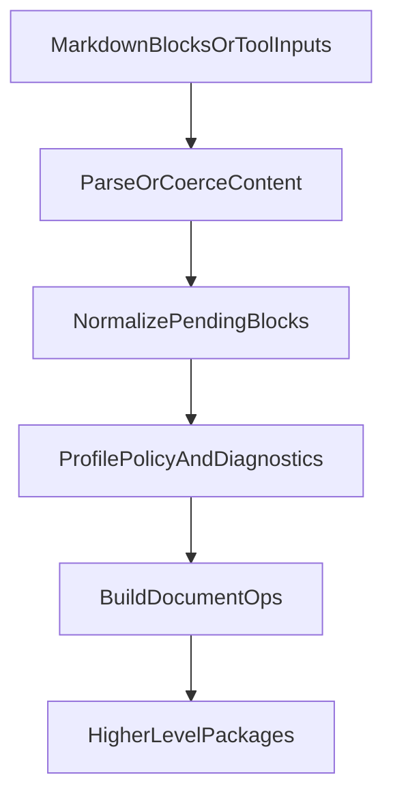

# @input/pen-content-ops

## Purpose

`@input/pen-content-ops` is a compatibility package over helpers that now live in `@input/pen-core`, plus the Markdown parse and write-op construction that still live here.

## Public Role

This package used to sit *under* core (core imported it). That inversion is gone: content-ops now depends on `@input/pen-core` and re-exports the moved helpers. Hosts should import those helpers from core. This package remains because importers and document-ops still call `parseMarkdownToBlocks()` and `buildDocumentWriteOps()` here.

## Key Exports / Entrypoints

- Export map: `.`
- Re-exports from `@input/pen-core`: `blocksToOps()`, `normalizePendingBlocksForImport()`, `filterPendingBlocksForDocumentProfile()`, `createImportResult()`, diagnostic reporting helpers, and the block-capability helpers (`getFlowCapabilityFromSchema()`, `shouldExposeBlockInTooling()`, and siblings)
- Still implemented here: `parseMarkdownToBlocks()`, `splitPlainTextLineBlocks()`, `buildDocumentWriteOps()`, and the structured-target / plan helpers
- Structured target and plan normalization helpers for tooling and AI-oriented write flows
- Workspace scripts: `build`, `clean`, `test`, `typecheck`

## Dependencies And Boundaries

- Runtime dependencies: `@input/pen-core`, `@input/pen-types`, `htmlparser2`, `mdast-util-from-markdown`, `mdast-util-gfm`, `micromark-extension-gfm`
- Peer dependencies: No peer dependencies declared.
- Boundary: `@input/pen-content-ops` is a shared transformation library and should not become an end-user entrypoint or runtime authority package.

## Runtime Model

`@input/pen-content-ops` turns content-like inputs into normalized pending blocks and operation lists that higher-level packages can safely apply:

```mermaid
flowchart TD
  Inputs[MarkdownBlocksOrToolInputs]
  Parse[ParseOrCoerceContent]
  Normalize[NormalizePendingBlocks]
  Policy[ProfilePolicyAndDiagnostics]
  Ops[BuildDocumentOps]
  Higher[HigherLevelPackages]

  Inputs --> Parse
  Parse --> Normalize
  Normalize --> Policy
  Policy --> Ops
  Ops --> Higher
```

Important rules:

- Pending blocks are intermediate structures, not final editor truth.
- Schema and document-profile policy still decide what survives normalization.
- This package prepares operations and diagnostics, but a higher-level package still decides when to call `editor.apply(...)`.

## Integration Notes

- Path in workspace: `packages/shared/content-ops`
- Spec path mirrors workspace path: `packages/shared/content-ops.md`
- Use this package when building importers, AI/document tools, or structured write flows that need schema-aware normalization before mutation
- `buildDocumentWriteOps()` is especially important because it unifies text, markdown, and block-shaped write inputs behind one normalization path
- Keep package consumers responsible for runtime application, undo grouping, and UI affordances

## Current Maturity / Intended Usage

Workspace package at version `0.0.0`; intended usage is current-state but still evolving. It is already a high-leverage package because many higher-level features depend on its normalization and write-op rules staying stable.

## Non-goals

- Do not leak product-facing abstractions into generic shared helpers.
- Do not move editor state ownership or renderer behavior into this package.
- Do not let convenience parsing helpers become a substitute for higher-level policy or runtime boundaries.
